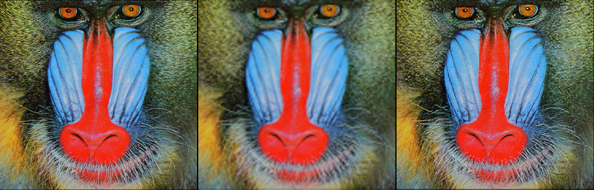

### PyTorch Super-resolution

Single-Image Super-Resolution with:

- Conditional patch-GAN
- LPIPS
- Sub-pixel convolutions

#### Usage

To upsample a target image:

```python3
python3 infer.py --load_dir=TRAINED_MODEL --input_image=INPUT --output_image=OUTPUT --bicubic_output=OPTIONAL_BICUBIC_BASELINE
```

Results look like:

 

 <center>Figure 1: Original high-resolution image (left), low-resolution image (center) and super-resolution image (right).</center>


